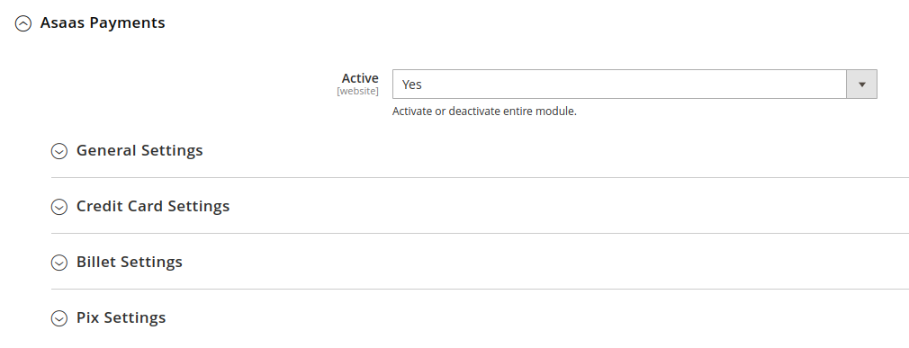
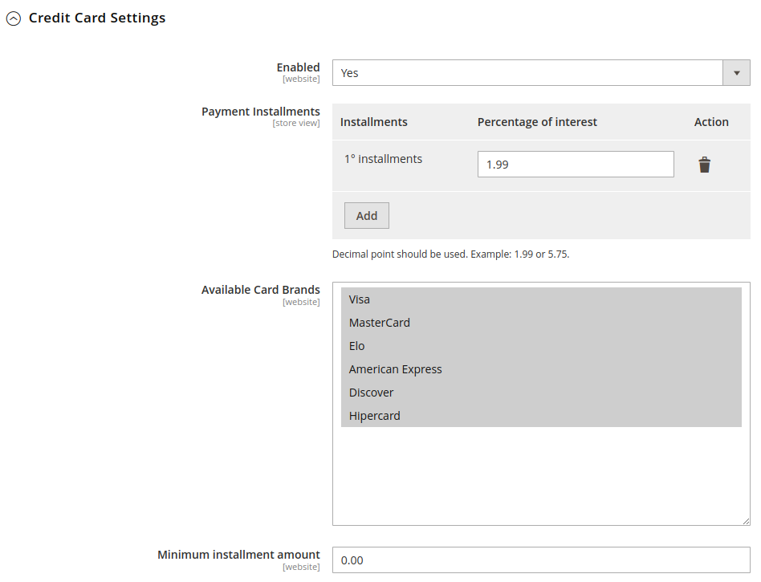
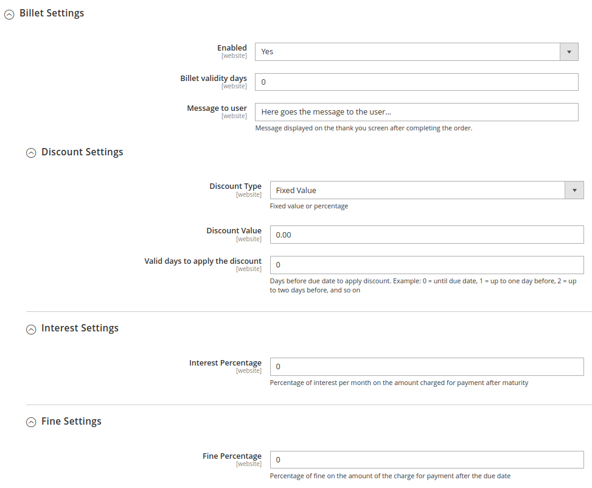

# Integration Module [Asaas Payments](https://www.asaas.com/) 

## Installation

> We recommend having a test environment to validate changes and updates before updating your production store. Also, make sure to create a backup with all information before executing any update/installation procedures.

### Compatible Versions

- [x] 2.4.x
 
### Prerequisite

- PHP version must be at least 7.4.X.

### Asaas Module Installation

- Download the module by cloning this repository, and follow the steps below according to how your store was installed:

### Install using Composer

1. Install via packagist 
   - ```composer require asaas/module-magento2```
       - At this point, your Magento authentication credentials may be requested. If you have any questions, there is a description of how to proceed in this [official documentation link](http://devdocs.magento.com/guides/v2.0/install-gde/prereq/connect-auth.html).
2. Run the commands:
   - ```php bin/magento setup:upgrade```
   - ```php bin/magento setup:static-content:deploy``` ou ```php bin/magento setup:static-content:deploy pt_BR```, according to your store's configurations.

### Install using GitHub

- If your store was created through the clone or download of the Magento project, follow these steps:

1. Extract the contents of the ZIP download and move it to ```Asaas/Magento2/``` folder.
2. Check if your directories in your store are like this: `app/code/Asaas/Magento2`.
3. Run the command ```bin/magento setup:upgrade```
4. Run the command ```bin/magento setup:di:compile```
5. Run the command ```bin/magento setup:static-content:deploy -f```
6. Run the command ```bin/magento cache:clean```


### Settings

Access the Magento Admin Panel and through the the left menu go to `Stores` > `Configuration` > `Customers` > `Customer Configuration` > `Name and Address Options`. In `Number of Lines in a Street Address` you should inform the number 4, as shown in the image below:


After configuring the Customer, Access the Magento Admin Panel and through the the left menu go to `Stores` > `Configuration` > `Sales` > `Payment Methods`. The screen to configure the payment methods of the store will be loaded.

<p align="center">
  
</p>

### How to enable Asaas on your site

In the first information block, there is the configuration to enable or disable the module completely, check `Yes` to continue the configuration.

Next, we have `General Settings`, `Credit Card Settings`, `Billet Settings` and `Pix Settings`.

Note: For the following settings to work, all the previous steps must have been followed.




### General Settings

- Api Key
	- Asaas account integration key. Production and sandbox tokens are distinct.

 - Debug
    - Enables or disables debug functionality.

- Environment
	- Selects which environment version the site will be pointing to. The available environments are: Desenvolvimento (Development) and Produção (Production).
	
- URL for Billing Webhooks
	- URL to be informed in the billing webhook on the Asaas website, so that at the moment of payment approval, the order status is changed.
	
- Display Order
    - Display order of the enabled payment methods in the module being shown on the Checkout screen.

- Authentication Token
    - Token to authenticate requests coming from the Asaas Webhook.

- Enable notifications between Asaas and buyer
    - Enables email messages informing payment status changes. This option can be enabled or not.


### Credit Card Settings

- Enabled
	- Enables or disables the credit card payment method.

- Payment Installments
    - Set maximum number of allowed installments and percentage of interest to each installment.

- Available Card Brands
	- Select credit card brands supported by the store for payment.

- Minimum installment amount
    - Set the minimum installment amount allowed



### Billet Settings

- Enabled
	- Enables or disables the billet payment method.

- Billet validity days
    - Gets the current date and adds the requested number of days to the billet expiration.

- Message to user
	- Message displayed on the thank you screen after completing the order.

- Discount Settings, Interest Settings, and Fine Settings allow you to set the discounts, interest, and fines of the billet, respectively.



### Pix Settings

- Enabled
	- Enables or disables the pix payment method.

- Pix expiration days
    - Gets the current date and adds the requested number of days to the QR Code expiration.

- Message to user
	- Message displayed on the thank you screen after completing the order.


